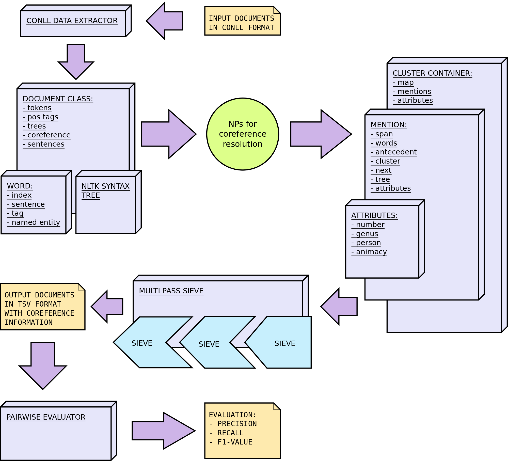

# MuSiCoR
## Multi Sieve Coreference Resolutor

## Description:
MuSiCoR is the implementation of a multi sieve coreference resolution system based
on [this paper](https://aclanthology.org/D10-1048/).
MuSiCoR was written to work with the [ontonotes dataset in CoNLL format](https://cemantix.org/data/ontonotes.html).
During processing, NPs are collected and then passed to the multi sieve module which will
apply different sieves to the mentions to resolve coreference. Each sieve works independently from the other and will
only try to solve coreference for those mentions that do not have an antecedent yet.

Available Sieves:
* ExactMatch: 2 mentions will be linked if they have the same words (upper or lower case will be ignored)
* PreciseConstructs: 2 mentions will be linked if they are in one of the following relations:
    * Acronym: [NBC] ... [Nakahama Broadcast Corporation]
    * Apposition: [The prince of Zamunda], [Akeem Joffer], arrived ...
    * Predicative: [Holland] is [the Netherlands]
    * Head of: [[the mutinous crew] of the HMS Bounty]
* Pronoun: a pronominal mention will be linked to another mention if their attributes (number, person, genus, animacy) are compatible

## Requirements
* nltk  

All requirements are saved in environment.yml  

Developed on: Ubuntu 20.04  
Tested on: Ubuntu 20.04, Windows 10

### Quickstart:
* install [Miniconda](https://docs.conda.io/en/latest/miniconda.html)
* cd into the root directory of this repository
* create a new environment from the environment.yml file
```
conda env create -f environment.yml
```

* activate the new environment
```
conda activate musicor
```

## Structure and Data Flow


### Structure of the Project
The project is structured in different packages that are intended to work independently from each other, that means, that they do not require particular data structures or algorithms used by other packages. MuSiCoR, the main program, will use use these packages to extract coreference information from a corpus. Since each package is independent, they can be modified so that MuSiCoR can, for example, work with other input files or use other metrics for the evaluation.

#### Directory Structure:
* datareader: this package is used to read the CONLL files
* mps: the Multi Pass Sieve package
  * sieves: sieves modules
  * text: data structures to represent and manipulate a text
  * utils: utility functions for the multi pass sieve package
* pairwise_evaluator: this package is used to evaluate the data obtained from the extractor
* src: the source code of musicor
  * main_functions: main functions (evaluate, extract) of musicor
  * utils: utility functions for musicor
* tests: unit tests for the entire project

## Synopsis
MuSiCoR has 2 basic functions: extract and evaluate.

```
usage: musicor [-h] {extract,evaluate} ...

MuSiCoR: Multi-Sieve Coreference Resolutor

positional arguments:
  {extract,evaluate}
    extract           extract coreference information
    evaluate          evaluate the performance of the extraction against a
                      golden standard

optional arguments:
  -h, --help          show this help message and exit
```

The instruction page of each function with a detailed explanation of the arguments can be called with:

```
$ python musicor.py extract -h
$ python musicor.py evaluate -h
```

### Extract
```
usage: musicor extract [-h] [-s] PATH

positional arguments:
  PATH          Path to the configuration file

optional arguments:
  -h, --help    show this help message and exit
  -s, --single  disable multithreading
```

This mode will take as the sole argument a configuration file containing 
information about the corpus, the output directory and the name and order 
of the sieves that will be applied to extract coreference information.
MuSiCoR will produce in the output directory for each file in the corpus 2 new files containing
coreference information:
* filename.preds: contains coreference chains extracted by MuSiCoR
* filename.gold: contains golden coreference chains

By default, the extractor will take advantage of concurrency to process more documents
at the same time. To turn this off, use the ```--single``` option (also useful for debugging).

#### Examples:
```
$ python musicor.py extract config.ini
$ python musicor.py extract config.ini -s
```

#### Configuration File:
```
[PATH]
input = data/flat_train_2012
output = extracted

[SIEVES]
sieves = ExactMatch, PreciseConstructs, Pronoun
```
* Path Section
    * input: path to the folder where the input files are saved
    * output: output folder where the TSV files will be saved (it will be created if not present)

* Sieve Section
    * sieves: Comma separated names of the sieves that MuSiCoR should use. The sieves will be applied in
        the order they are saved in the configuration file

A list of available sieves can be found in the [description](#description)

#### Output File:
The extractor produces for each file 2 TSV files (filename.preds and filename.gold)
with the following structure:
```
26,28	152,153	358,362	364,364
43,44	396,397
47,49	62,65
55,55	60,65	70,70
93,93	103,103
```

Each line of the file represents a new coreference chain and each mention of the chain is a comma separated word span.
Spans are inclusive and 0-indexed.

In this Example we have 5 clusters:
* words 26 to 28 - words 152 to 153 - words 358 to 362 - word 364
* words 43 to 44 - words 396 to 397
* words 47 to 49 - words 62 to 65
* word 55 - words 60 to 65 - word 70
* word 93 - word 103

This output format is human readable and highly independent from the rest of the program or python itself. It can therefore be easily integrated in other projects.

### Evaluation
```
usage: musicor evaluate [-h] [-v] PATH

positional arguments:
  PATH           Path to the folder containing the extracted files

optional arguments:
  -h, --help     show this help message and exit
  -v, --verbose  Additionally saves a log file with precision, recall and f1
                 score for each single file
```
This function will take as argument the directory where the .preds and .gold files are saved.
These files are collected and used to evaluate the accuracy of the extraction performed
by MuSiCoR by calculating precision, recall and F1-score. With the ```--verbose``` option it is
also possible to save a log file (evaluation.log) with precision, recall and F1-score for
each individual file in the corpus.

#### Examples:
```
$ python musicor.py evaluate extracted/
$ python musicor.py evaluate extracted/ -v
```

## Tests
To run all tests:
```
$ python -m unittest
```

To test only parts:
```
$ python -m unittest -k test_words_mentions
$ python -m unittest -k test_sieves
$ python -m unittest -k test_clusters
```

## Demos
Some Classes have a separate Demo showing their main functions.
Demos can be showed by running single modules of the project:
```
$ python -m mps.text.word
$ python -m mps.text.cluster_container
$ python -m mps.text.attributes
```

##  Known Bugs
All bugs are unknown

## Sources
[Multi-Pass Sieve for Coreference Resolution](https://aclanthology.org/D10-1048/)
